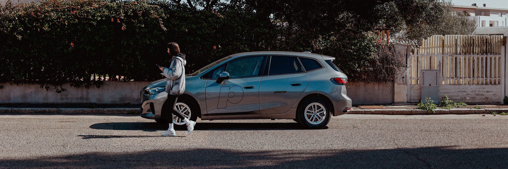

# Playcar 🚗

## Mobilità condivisa, sostenibile e intelligente.

Benvenuto nel profilo GitHub di Playcar Srl, il primo servizio di car sharing in Sardegna. Siamo impegnati a rivoluzionare la mobilità urbana attraverso soluzioni sostenibili, innovative e accessibili a tutti.

### 🔗 Scopri di più su di noi: [playcar.net](https://playcar.net)

## 🚗 Cosa facciamo:
- Promuoviamo l'uso condiviso dei veicoli per ridurre l'inquinamento e migliorare la qualità della vita.
- Offriamo un'ampia flotta di veicoli pronti per essere noleggiati tramite app e servizi digitali.
- Supportiamo progetti di mobilità innovativa e sostenibile.

## Seguici per scoprire i nostri progetti open-source e come stiamo costruendo il futuro della mobilità! 🚀
### [Linkedin](https://www.linkedin.com/company/playcar-srl/)
### [Instagram](https://www.instagram.com/playcarcarsharing/)
### [Facebook](https://www.facebook.com/playcarcarsharing/)